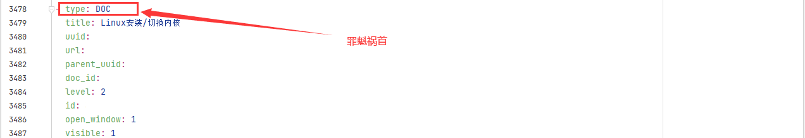
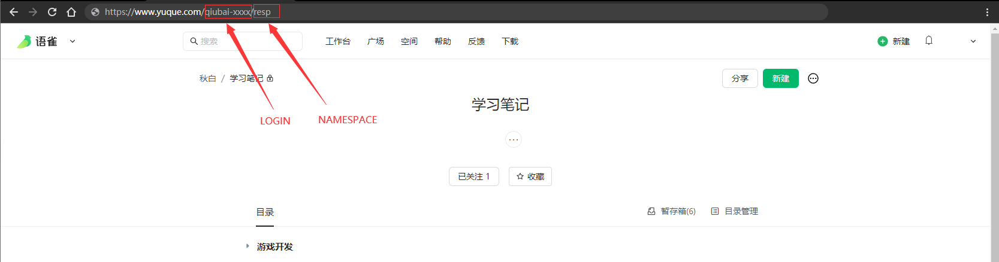

## 一、羽雀知识库备份工具

> 因为想把羽雀上的知识库迁移到本地配合typora用，但是网上的备份工具基本都是**只导出文件不导出目录**，因为笔记稍微有一点多要一份份整理很麻烦，所以就决定自己写一个工具做备份，然后就花了一晚上时间写了这份屎代码，代码没时间优化但是能跑起来就行。

## 二、BUG说明

> 由于羽雀文档的目录树处理起来非常麻烦（开始理解为什么其他作者都不想搞这个破目录了），几乎所有BUG都是出现在这个目录上，但是通常并不影响代码继续跑。

### 1. 部分目录错乱的问题

> 由于目录树里面每个节点类型的问题，有些目录类型的节点如果里面写了内容，就会从`TITLE`变成`DOC`,导致我们的目录在判断过成功会出现一点点小错误，但是不影响，嫌麻烦可以不用管这个BUG，后面自己调整目录也完全没有问题。

```
由于代码逻辑非常简单，花两分钟就可以看完。
```



## 三、使用说明

### 1. 安装依赖

```
# 项目一共使用了2个库 yml 和 request,直接安装就可以了

> pip install yml
> pip install reqeusts
```

### 2. 配置TOKEN和知识库NAMESPACE和TOKEN

> config/conf.py

```python
LOGIN = "qiubai-xxxx" # 用户ID
NAMESPACE = "resp"    # 知识库
YUQUE_TOKEN = "XXXX"  #TOKEN

BASE_PATH = "data/yuque_data_{0}/".format(LOGIN)
BASE_API = "https://www.yuque.com/api/v2/"
REQUEST_HEADERS = {
    "User-Agent": "yuque_backup/0.1",
    "X-Auth-Token": YUQUE_TOKEN
}
```



### 3. 开始运行

> main.py

```
python3 main.py
```

### 4. 结果保存

> data/yuque_data_{LOGIN}

```
笔记会按照目录保存在data目录下，有部分目录父节点出错的笔记会直接放到NOPATH里，只能靠大家动动手自己整理了。
```

